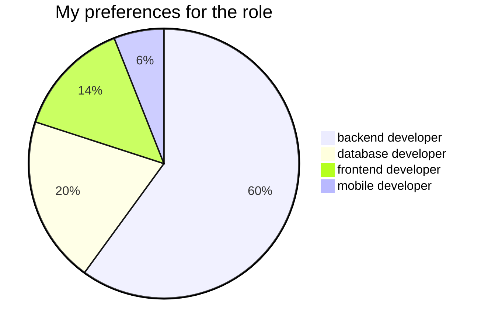

<h1 align="center">Hi there, I'm Bahaa </h1>

<h2>Studied at:</h2>

- <a href="https://www.vstu.ru/">VSTU</a> (Volgograd State Technical University) [Bachelor’s Degree Program: "software engineering"]

<h2>What do I want to work as?</h2>

<blockquote>But I am always happy to learn new things and become part of a team very quickly. So with proper training, I'm ready to try myself a new role.</blockquote>

<h2>What Languages and Tools do I use?</h2>

                      

  

<!--

<!--
**VladimirNikel/VladimirNikel** is a ✨ _special_ ✨ repository because its `README.md` (this file) appears on your GitHub profile.

Here are some ideas to get you started:

- 🔭 I’m currently working on ...
- 🌱 I’m currently learning ...
- 👯 I’m looking to collaborate on ...
- 🤔 I’m looking for help with ...
- 💬 Ask me about ...
- 📫 How to reach me: ...
- 😄 Pronouns: ...
- ⚡ Fun fact: ...
-->
